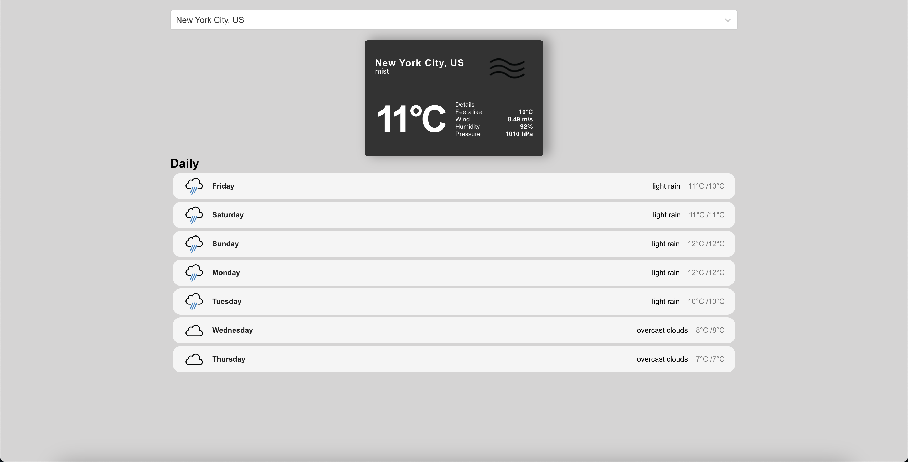

# Weather App - ReactJS

## 📷 Screenshot

  

## 📝 Project Description

Weather app is used to search for different cities to display the current weather with the OpenWeather API and GeoDB Cities API.

## 📚 Technologies

- [ReactJS](https://reactjs.org/)
- [Vercel](https://vercel.com/dashboard)
- [API: OpenWeather API](https://openweathermap.org/)
- [API: GeoDB Cities API](https://rapidapi.com/wirefreethought/api/geodb-cities/)
